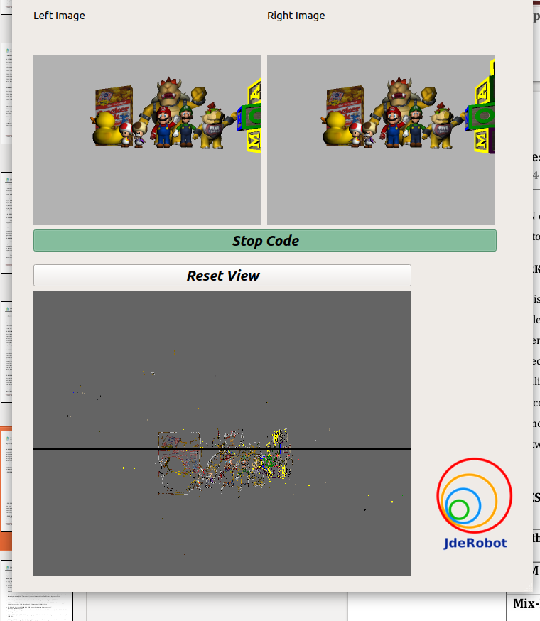

In this new blog we are going to try to solve the problem of 3d reconstruction using stereo images.

Given two 2d images of the same scene, we want to paint a 3D point cloud that represents the final scene in these dimensions.

The problem begins with two images taken from a scene using two different cameras, one on the left of the other. The first thing we have to find are the characteristic points of both images and try to map them with those of the other image.

Before finding the characteristic points, a series of filters are carried out to clean the image. The first that is carried out is a bilateral filtering that allows us to eliminate part of the image noise and small details.

Subsequently, a Canny filter is performed to obtain the edges of the two images, this will facilitate obtaining characteristic points and reduce execution times.

Once we have located the edges of our images, we will try to find the pixels that are the same in the two images. For this, the function of opencv matchTemplate is used. We will need to create a template for each pixel in order to use this function.

To do this, we are going to look for each pixel with value 1 in the canny image and we are going to create a template of 7x7 pixels. Simultaneously, an epipolar stripe will be generated. This epipolar strip has a width of 10 pixels and will allow us to focus the search for a homologous point in the second image.

With the matches found we can easily obtain the coordinates of each match in the left image and in the right image. With these coordinates we can use the function of opencv triangulatePoints, which we pass the points of the two images that we want to transform to 3d coordinates and the projection matrices of each image returns the coordinates in a 4d vector. To obtain a vector with 3 coordinates, what has been done is divide the first 3 coordinates of our vector by the last coordinate.

Finally, we will need to find the color of the point we want to find. We will use the pixel coordinates with value 1 in the canny image and look for its value in the original image on the left. It is necessary to normalize the color between 0-13

